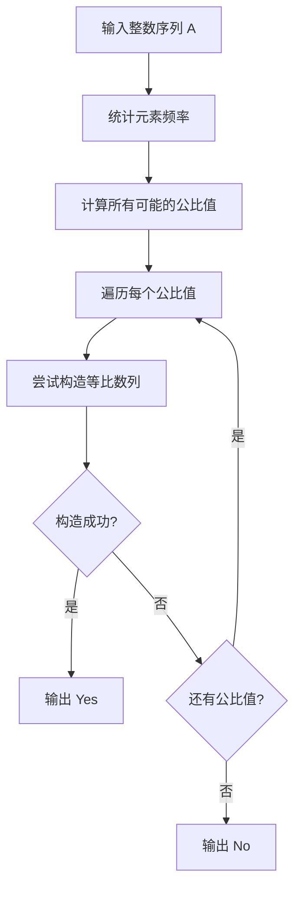
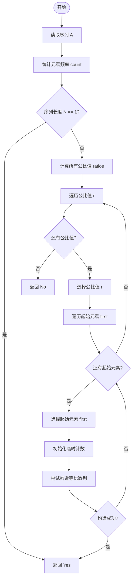
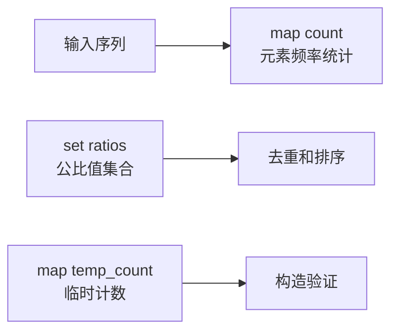
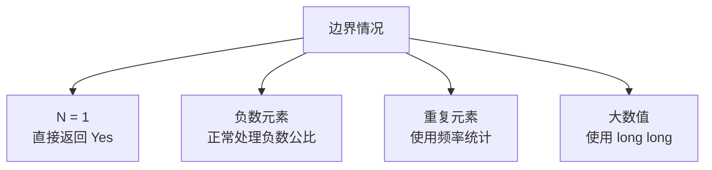

# 等比数列判断算法总览

## 算法核心思想



## 详细执行流程



## 序列构造验证流程

```mermaid
flowchart TD
    Start([开始构造]) --> Init[初始化: i=1, temp_count=count]
    Init --> CheckI{i < N?}
    CheckI -->|否| Success[返回成功]
    CheckI -->|是| Calc[计算: next_val = first * r^i]
    Calc --> Round[四舍五入: next_int = round(next_val)]
    Round --> CheckExist{next_int 在 temp_count 中?}
    CheckExist -->|否| Fail[返回失败]
    CheckExist -->|是| Remove[从 temp_count 移除 next_int]
    Remove --> IncI[i = i + 1]
    IncI --> CheckI
```

## 关键数据结构



## 时间复杂度分析

```mermaid
graph LR
    A[输入规模 N] --> B[计算公比值<br/>O(N²)]
    B --> C[遍历公比值<br/>O(N²)]
    C --> D[构造验证<br/>O(N)]
    D --> E[总体复杂度<br/>O(N³)]
```

## 优化策略

```mermaid
graph TD
    A[优化策略] --> B[浮点数精度<br/>使用 round() 函数]
    A --> C[元素重数<br/>使用 map 统计]
    A --> D[提前返回<br/>找到解立即退出]
    A --> E[去重公比<br/>使用 set 集合]
```

## 边界情况

