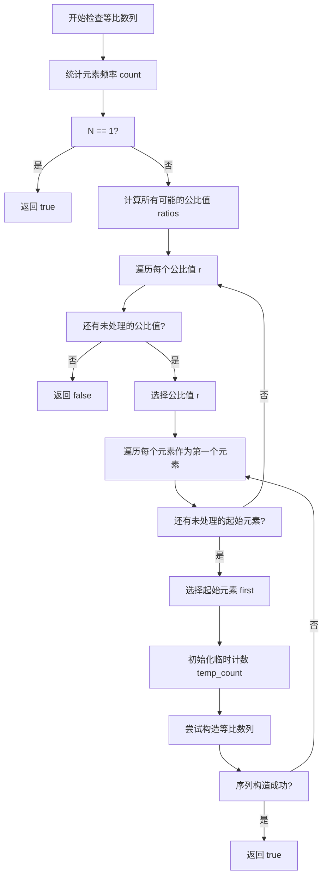
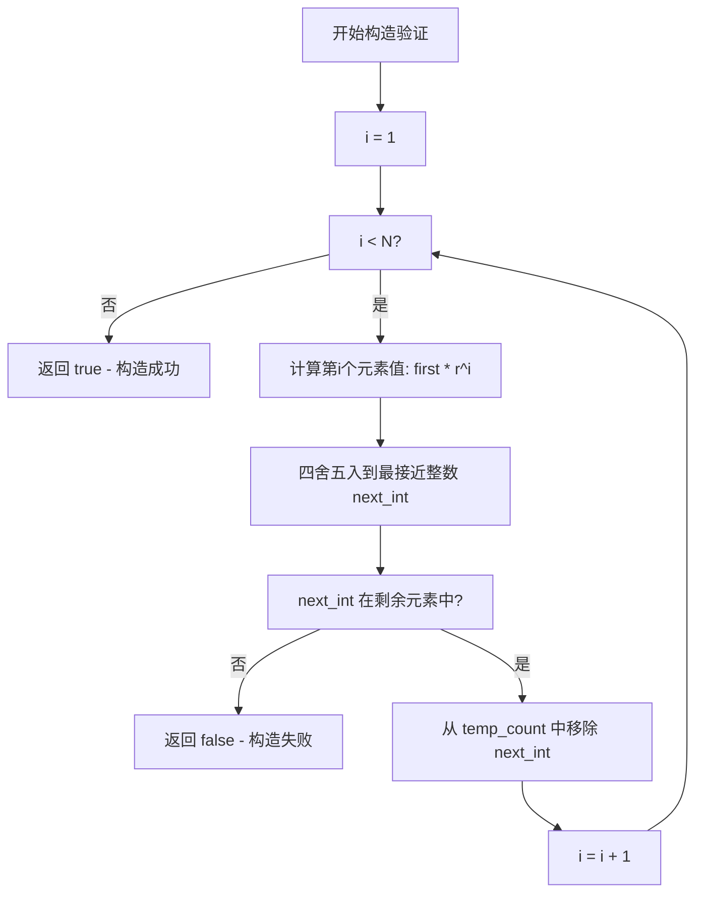
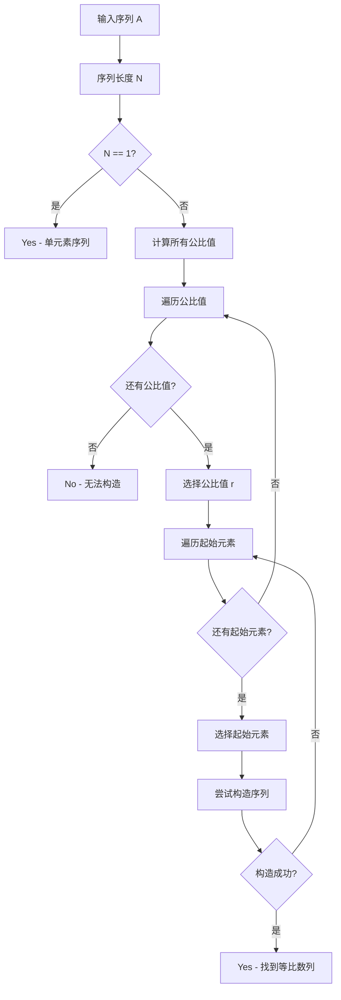
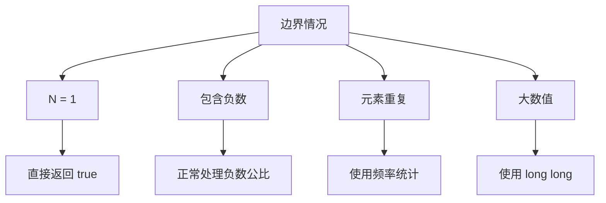

# D - Make Geometric Sequence 算法流程图

## 主程序流程

```mermaid
flowchart TD
    A[开始] --> B[读取测试用例数量 T]
    B --> C[T > 0?]
    C -->|否| Z[结束]
    C -->|是| D[读取序列长度 N]
    D --> E[读取序列 A[1...N]]
    E --> F[调用 canFormGeometricSequence函数]
    F --> G[输出结果 Yes/No]
    G --> H[T = T - 1]
    H --> C
```

## 核心算法流程



## 序列构造验证流程



## 公比值计算流程

```mermaid
flowchart TD
    A[开始计算公比值] --> B[i = 0]
    B --> C[i < N?]
    C -->|否| F[返回所有公比值]
    C -->|是| D[j = 0]
    D --> E[j < N?]
    E -->|否| G[i = i + 1]
    G --> C
    E -->|是| H[i != j 且 A[j] != 0?]
    H -->|否| I[j = j + 1]
    I --> E
    H -->|是| J[计算 ratio = A[i] / A[j]]
    J --> K[将 ratio 加入集合]
    K --> I
```

## 完整算法决策树



## 时间复杂度分析

```mermaid
flowchart LR
    A[输入规模 N] --> B[计算公比值 O(N²)]
    B --> C[验证每个公比 O(N²)]
    C --> D[构造序列验证 O(N)]
    D --> E[总体复杂度 O(N³)]
```

## 空间复杂度分析

```mermaid
flowchart LR
    A[输入序列] --> B[元素频率统计 O(N)]
    B --> C[公比值集合 O(N²)]
    C --> D[临时计数映射 O(N)]
    D --> E[总体空间 O(N²)]
```

## 关键优化点

```mermaid
flowchart TD
    A[算法优化策略] --> B[浮点数精度处理]
    A --> C[元素重数管理]
    A --> D[提前返回优化]
    A --> E[去重公比值]
    
    B --> F[使用 round() 函数]
    C --> G[使用 map 统计频率]
    D --> H[找到解立即返回]
    E --> I[使用 set 去重]
```

## 边界情况处理

