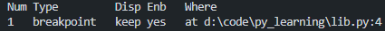

# pdb 调试

# 一、 资源链接

- [[Python] 用 pdb 轻松调试你的代码！_哔哩哔哩_bilibili](https://www.bilibili.com/video/BV178HVejEjq/?spm_id_from=333.788&vd_source=ced5a6d5721fd19bf99bfaff1eb49a03)
- [python 调试工具 pdb 的基本用法(Python Debugger)_python pdb-CSDN 博客](https://blog.csdn.net/qq_43799400/article/details/122582895)

# 二、 学习内容

## 2.1  相关命令

### 命令

调用命令,例如上面给出的示例代码的调用命令:

`python -m pdb main.py`

| 命令      | 描述                                                       |
| --------- | ---------------------------------------------------------- |
| `l`       | 显示当前行的源代码。                                       |
| `n`       | 执行下一行代码，如果当前行包含函数调用，直接执行完该函数。 |
| `s`       | 执行下一行代码，如果当前行有函数调用，进入函数内部。       |
| `c`       | 继续执行程序，直到遇到下一个断点或程序结束。               |
| `b`       | 设置断点，可在当前行、指定行号或指定文件行号设置断点。     |
| `cl`      | 清除断点，可以清除特定断点或所有断点。                     |
| `p`       | 打印变量的值。                                             |
| `q`       | 退出调试器，并终止程序运行。                               |
| `r`       | 继续执行代码，直到从当前函数返回。                         |
| `w`       | 显示调用栈，查看程序当前的调用路径。                       |
| `u` / `d` | 在调用栈中向上或向下移动一层，查看不同栈帧中的代码和变量。 |
| `h`       | 显示帮助信息，`h` 或 `help` 后跟命令名可查看详细帮助。     |

### 演示代码_1(其中代码故意添加了错误,但是可以执行)

```python
#文件名 main.py
import lib

def main() -> None:
    num_list = [1, 2, 3, 4, 5]
    result = lib.square_sum(num_list)
    print(f"square sum of {num_list} is {result}")

main()
```

```python
#文件名 lib.py
from typing import Sequence

def square_sum(num:Sequence[int]) -> int:
    result = 0
    for i in range(len(num)):
        n = num[1]
        result += n**2
    return result
```

### 演示代码_2(代码不可执行,程序崩溃)

```python
# 文件名test.py
def add(n):
    return n+1
add("hello")
```

可以使用 python 的交互模式

`python - i test.py`

再执行:

```python
import pdb
pdb.pm()
```

再进行调试,调试结束后使用 q 命令推出 pdb,再在 python 解释器中使用 quit()或 exit()退出

### 注意事项

1. 函数的定义和函数体都算作一条完整的语句,在执行 n/next 命令时会全部跳转
2. 直接按回车 pdb 会执行上一次的命令
3. 要进入函数,我们可以使用 s/step 命令
4. 如果不想一步一步调试可以使用 c/contine 命令,让程序直接运行到下一个断点或者结束程序
5. 可以使用 b/break 命令来设置断点

> 例如:我要在 lib.py 文件中的第 4 行设置断点,可以使用命令 b lib.py:4
> 如果不给 b/break 命令添加参数,列出当前设置的所有断点

1. 可以使用 cl/clear 命令来清除断点

> 例如: cl < 断点序号 >  断点序号就是 b 命令打印出来的断点对应的数字
> cl 不加任何参数会删除所有断点

1. 断点还可以通过 disable+ 序号来进行禁用,或者使用 enable+ 序号来重新启用



b 命令中的 Enb 一列显示的是断点是否启用,如上图所示

1. 我们可以使用 until 命令告诉 pdb 直接运行到指定的行号
2. 可以使用 p 命令来查看变量的值

> 因为 pdb 的命令是直接支持 python 语法的,可以将需要打印的列表放在一起,作为列表打印出来
> 
> 相关建议:用 p 命令打印一些复杂的结构的时候,结果可能会很乱,例如这里打印全局变量的话
> P globals() #这里的 globals()就是 python 的普通函数的调用
> 可以使用 pp 命令来格式化输出

1. w/where 命令可以显示当前函数的调用堆栈,我们可以 up 命令来切换到上一个函数调用栈,对应的还有 down 命令


这里不太显眼的大于号表示的就是我们现在处于的函数调用栈,注意 up 和 down 命令只用于切换函数调用栈,并不执行任何语句,因此我们可以随意地移动上下文

1. 最后 help 命令可以列出所有 pdb 支持的所有命令,可以使用 help+ 命令名来获取更加详细的信息
2. 上面的命令在 c 语言调试器 gdb 也是通用的
